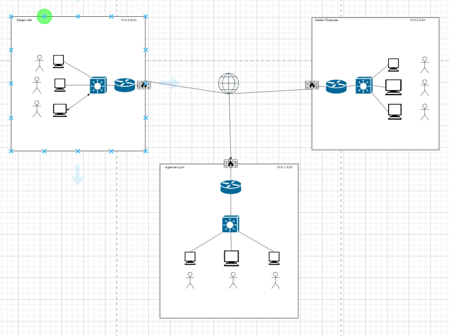
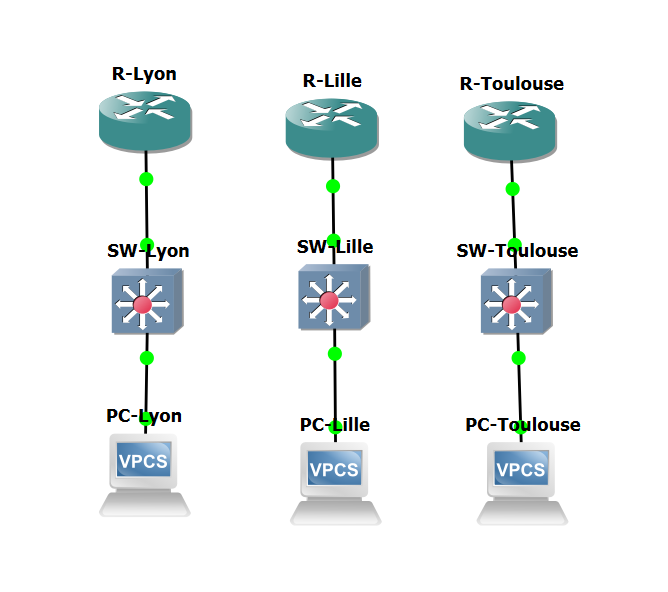

# TP_Reseaux Yarkin ONER

## **1 : Questions avant de commencer**

- 1 : Quelle topologie est la plus courante en entreprise ?

```` Topologie en étoile ````

- 2 : Quel est le principal avantage du SD-WAN pour les entreprises multi-sites ?

```` La gestion centralisée et l’optimisation du trafic.````

- 3 : Dans le modèle OSI, quelle couche correspond au routage IP ?,

````La couche 3 – La couche réseau````

- 4 : Quelle est la principale différence entre TCP et UDP ?

```` TCP est un protocole orienté connexion ````

```` UDP est non orienté connexion ````

- 5 : Quel est le rôle du protocole ARP ?

````ARP permet de traduire une adresse IP en adresse MAC sur un réseau local. ````

- 6 : Que signifie la notation /26 dans une adresse IP ?

````Cela indique un masque de sous-réseau de 26 bits, ce qui donne 64 adresses.````

- 7 : Quelle méthode de transition permet de faire coexister IPv4 et IPv6 sur un même réseau ?

````La méthode Dual Stack, qui permet à un équipement d’utiliser simultanément IPv4 et IPv6.````

- 8 : Quelle est la différence entre un pare-feu stateless et un pare-feu stateful ?

````Stateless : filtre les paquets individuellement sans suivre l’état des connexions.````

````Stateful : garde la trace des connexions, donc plus sûr.````

- 9 : Que signifie le principe de "deny by default" dans la configuration d’un pare-feu ?

````Cela veut dire que tout le trafic est bloqué par défaut, et qu’il faut autoriser explicitement le trafic souhaité.````


- 10 : Cite un exemple de pare-feu open-source et un pare-feu d’entreprise.

````Open-source : OPNsense````

````Entreprise : Cisco ASA````


## **2 : Schema d'architecture**

- 


## **3 : Configuration GNS3 fonctionnel**


- 